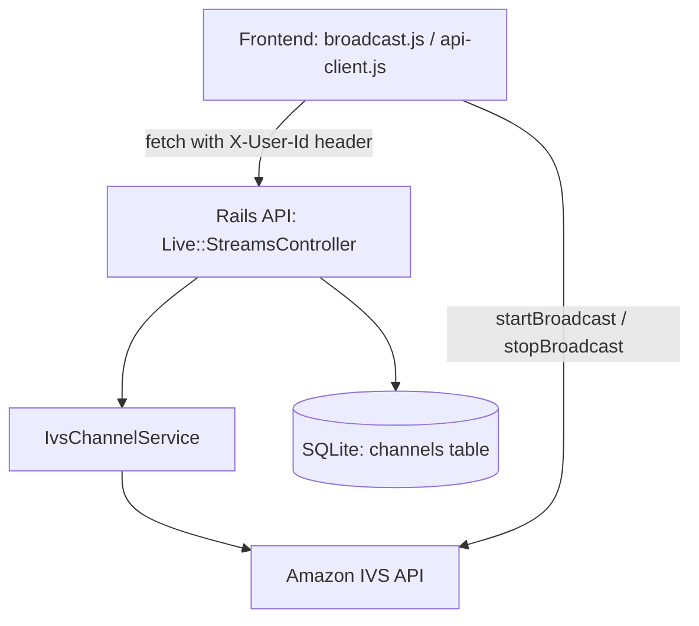
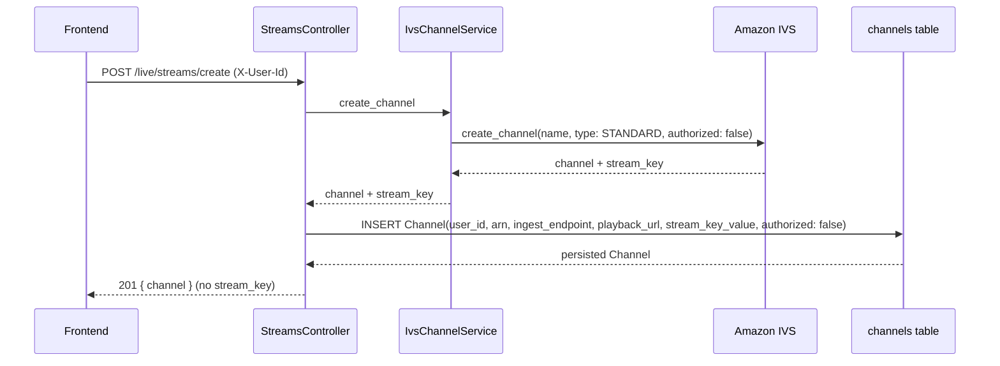
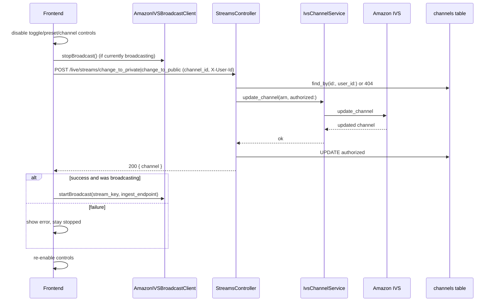
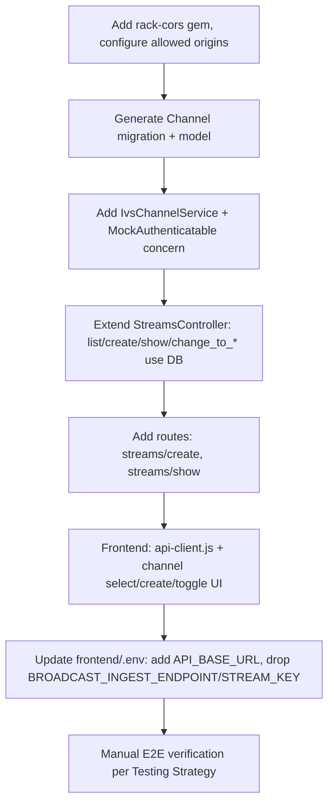

# Technical Design

## Overview

This feature connects the static `frontend/` broadcast demo to the `live-control-plane` Rails API so that Amazon IVS channels are created, listed, and toggled between public/private through the backend instead of being hardcoded in `frontend/.env`. The backend gains a `Channel` persistence layer scoped to a mock user identity; the frontend gains an API client, a channel creation/selection UI, and a visibility toggle that safely stops and restarts the live broadcast.

**Users**: The single demo broadcaster (identified by a fixed mock user id held in the frontend) uses this to create a channel, pick it from a list on later visits, start broadcasting, and flip the channel between public and private while live.

**Impact**: `live-control-plane` moves from a stateless pass-through over `Aws::IVS::Client` (hardcoded ARNs, no DB) to a persisted `Channel` model that is the source of truth for "which channels belong to this user." `frontend/broadcast.js` moves from reading a static ingest endpoint/stream key out of `config.js` to fetching them from the backend for the channel the user selects.

### Goals
- Persist every IVS channel created through the API as a `Channel` record scoped to a mock user id.
- Let the frontend list, create, and select channels, then broadcast using the selected channel's credentials.
- Let the frontend toggle a channel's public/private state with a stop-then-restart broadcast sequence that never leaves the broadcast running against a stale visibility state.
- Enable CORS so the frontend origin can call the API at all.

### Non-Goals
- Real authentication/authorization (the mock user id is an unvalidated opaque string, not a session/JWT-backed identity).
- Viewer-side playback token flow (`streams#playback_token`, `streams#user_kick`) — these endpoints already exist and are untouched by this feature.
- Deleting/archiving channels, editing channel name after creation, or reconciling orphaned AWS channels if a DB write fails after AWS creation succeeds (documented as an accepted risk under Error Handling).
- Multi-user auth, rate limiting, or production-grade secret storage for the stream key.

## Architecture

### Existing Architecture Analysis

- `live-control-plane` is a Rails 8 API-only app (`ApplicationController < ActionController::API`), sqlite3, no models/migrations yet, `solid_queue`/`solid_cache` installed but unused by this feature.
- `Live::StreamsController` already wraps `Aws::IVS::Client` for `list`, `create`, `change_to_private`, `change_to_public`, `playback_token`, `user_kick`, but every action either hardcodes an ARN/user id or returns AWS's transient response without persisting anything. `create` has no route.
- `IvsPlaybackTokenService` in `app/services/` establishes the project's convention of wrapping external-facing logic (AWS/JWT) in a plain service object rather than the controller — this design follows that same pattern for the new IVS channel calls.
- CORS is scaffolded (`rack-cors` in Gemfile, commented out; `config/initializers/cors.rb` present but fully commented out) and not active.
- `frontend/` has no bundler and no API client; `broadcast.js`/`player.js` read static values off `window.ENV`, itself generated from `frontend/.env` by `generate-config.js`.

### High-Level Architecture



**Architecture Integration**:
- Existing patterns preserved: flat action-based routes under `namespace :live` (`streams/list`, `streams/create`, ...), service-object wrapping of AWS calls (mirrors `IvsPlaybackTokenService`), `ApplicationController < ActionController::API`.
- New components: `Channel` model + migration (persistence didn't exist), `IvsChannelService` (extracted from controller for testability, matching the existing service pattern), `MockAuthenticatable` controller concern (centralizes the mock-user-id requirement instead of repeating it per action), `frontend/api-client.js` (single fetch layer for the new endpoints).
- Technology alignment: no new runtime dependencies beyond enabling the already-present `rack-cors` gem; frontend stays vanilla JS/no bundler, consistent with the rest of `frontend/`.

### Key Design Decisions

**Decision 1: The DB, not the AWS IVS API, is the source of truth for "my channels."**
- **Context**: Requirement 4.1 requires the channel list to be scoped to a mock user id, but Amazon IVS has no concept of a user/owner — `list_channels` returns every channel in the AWS account.
- **Alternatives**: (a) Call `list_channels` and filter using an IVS tag holding the mock user id; (b) maintain a separate ownership mapping outside the `Channel` record; (c) query the local `Channel` table directly.
- **Selected Approach**: `Live::StreamsController#list` queries `Channel.where(user_id: current_user_id)` and never calls AWS for listing.
- **Rationale**: Tag-based filtering adds an AWS round trip, eventual-consistency risk, and tag-quota complexity for no benefit in a demo scope; the DB is already the durable record created at channel-creation time.
- **Trade-offs**: If a `Channel` row and the live AWS channel ever diverge (e.g., someone deletes the channel directly in the AWS console), the list will show a stale/broken entry. Acceptable for this feature's scope (no delete/reconcile flow exists yet).

**Decision 2: Visibility toggle is a stop → persist → restart sequence driven by the frontend, not a server-side orchestration.**
- **Context**: Requirement 5 requires the broadcast to be stopped before the channel's `authorized` flag changes, and restarted only after the change is confirmed.
- **Alternatives**: (a) Have the backend own the stop/restart by pushing a command to the browser (WebSocket/ActionCable); (b) let the frontend orchestrate stop → API call → restart directly against the already-open `AmazonIVSBroadcastClient` instance.
- **Selected Approach**: (b) — the frontend calls `client.stopBroadcast()`, awaits the visibility-change API call, and on success calls `client.startBroadcast()` again with the same stream key/ingest endpoint (unchanged by a visibility switch).
- **Rationale**: The broadcast client only exists in the browser (camera/mic access, WebRTC); the backend has no channel over which to command it. A push-based approach would add ActionCable/WebSocket infrastructure for no functional gain here.
- **Trade-offs**: If the browser tab crashes or the request fails mid-sequence, the broadcast simply stays stopped (no auto-recovery) — acceptable per Requirement 5.5, which explicitly forbids auto-restart on failure.

**Decision 3: DB column is named `authorized` (matching the AWS IVS API field), not `private`.**
- **Context**: The persisted channel needs a public/private flag.
- **Alternatives**: `private:boolean`, `visibility:string` enum.
- **Selected Approach**: `authorized:boolean` — mirrors `Aws::IVS::Client#create_channel`'s and `#update_channel`'s own `authorized` parameter (`true` = viewers need a signed playback token = private; `false` = public).
- **Rationale**: `private` is a Ruby keyword used for method-visibility declarations; Active Record would generate a `private` instance method that shadows/collides with it. Naming the column after the upstream AWS attribute also removes a translation step between the DB, the service layer, and the AWS SDK call.
- **Trade-offs**: The API/DB layer speaks `authorized` while the UI and requirements speak "public/private" — the controller and frontend map `authorized: true/false` to the "private"/"public" labels shown to the user.

## System Flows

### Channel creation


### Select a channel and broadcast

```mermaid
sequenceDiagram
    participant FE as Frontend
    participant API as StreamsController
    participant DB as channels table

    FE->>API: GET /live/streams/list (X-User-Id)
    API->>DB: Channel.where(user_id:)
    DB-->>API: [Channel...]
    API-->>FE: 200 { channels: [...] } (no stream_key)
    FE->>FE: render <select>, user picks one
    FE->>API: GET /live/streams/show?channel_id= (X-User-Id)
    API->>DB: Channel.find_by(id:, user_id:)
    DB-->>API: Channel
    API-->>FE: 200 { channel } (includes stream_key)
    FE->>FE: startBroadcast(stream_key, ingest_endpoint)
```


### Public/private toggle while live


## Components and Interfaces

### Backend (`live-control-plane`)

#### `Channel` (model)

**Responsibility & Boundaries**
- **Primary Responsibility**: Durable record of an IVS channel owned by a mock user, including the data needed to broadcast to it (stream key, ingest endpoint) and its current visibility.
- **Data Ownership**: Owns `channels` table rows; the AWS-side channel is the upstream source for everything except `user_id`, which only this table tracks.

**Contract Definition**
| Attribute | Type | Notes |
|---|---|---|
| `user_id` | string, required | Mock owner id, opaque |
| `name` | string | IVS channel name |
| `arn` | string, required, unique | IVS channel ARN |
| `ingest_endpoint` | string, required | Bare hostname, as used by `frontend/broadcast.js` |
| `playback_url` | string, required | `.m3u8` URL |
| `stream_key_arn` | string | IVS stream key ARN |
| `stream_key_value` | string, required | Value passed to `client.startBroadcast` |
| `ivs_channel_type` | string, default `"STANDARD"` | Named to avoid the `type` STI column |
| `authorized` | boolean, required, default `false` | `true` = private, `false` = public (matches AWS attribute name; see Decision 3) |

- **Validations**: `user_id`, `arn`, `ingest_endpoint`, `playback_url`, `stream_key_value` presence; `arn` uniqueness.
- **Invariants**: A `Channel` is never persisted without a corresponding successful AWS `create_channel` response (see `IvsChannelService`).

#### `IvsChannelService` (service object, mirrors `IvsPlaybackTokenService`)

**Responsibility & Boundaries**
- **Primary Responsibility**: Sole place that talks to `Aws::IVS::Client` for channel create/update, isolating the AWS SDK shape from the controller.
- **Dependencies — External**: `Aws::IVS::Client` (`aws-sdk-ivs`, already a dependency).

**Contract Definition (Service Interface)**
```typescript
interface IvsChannelService {
  createChannel(name: string): { channel: IvsChannel; streamKey: IvsStreamKey };
  updateAuthorization(arn: string, authorized: boolean): { channel: IvsChannel };
}
```
- **Preconditions**: Valid AWS credentials in `ENV` (already configured via `dotenv-rails`).
- **Postconditions**: On success, returns the raw AWS response objects for the controller to map into a `Channel`. Raises `Aws::IVS::Errors::ServiceError` on failure (no rescuing inside the service — the controller decides the HTTP response).

#### `MockAuthenticatable` (controller concern)

**Responsibility & Boundaries**
- **Primary Responsibility**: Extract the mock user id from the `X-User-Id` request header and expose it as `current_user_id`; render `401` when absent.
- **Data Ownership**: None — pure request-scoped helper.

**Contract Definition**
```typescript
interface MockAuthenticatable {
  current_user_id(): string; // raises/halts with 401 via before_action if header missing
}
```
Included in `Live::StreamsController` via `before_action :require_user_id`, applied to `list`, `create`, `show`, `change_to_private`, `change_to_public` (not to the pre-existing `playback_token`/`user_kick`, which are out of scope).

#### `Live::StreamsController` (extended)

**Integration Strategy**: Extend the existing controller in place — same file, same action names except one addition (`show`) — rather than introducing a new controller, to keep the existing `playback_token`/`user_kick` actions and routing style untouched.

**API Contract**
| Method | Endpoint | Request | Response | Errors |
|---|---|---|---|---|
| GET | `/live/streams/list` | header `X-User-Id` | `{ channels: [ChannelSummary] }` | 401 |
| POST | `/live/streams/create` | header `X-User-Id`; body `{ name? }` | `201 { channel: ChannelSummary }` | 401, 502 |
| GET | `/live/streams/show` | header `X-User-Id`; query `channel_id` | `{ channel: ChannelDetail }` | 401, 404 |
| POST | `/live/streams/change_to_private` | header `X-User-Id`; body `{ channel_id }` | `{ channel: ChannelSummary }` | 401, 404, 502 |
| POST | `/live/streams/change_to_public` | header `X-User-Id`; body `{ channel_id }` | `{ channel: ChannelSummary }` | 401, 404, 502 |

`ChannelSummary` = `{ id, name, arn, ingest_endpoint, playback_url, authorized, ivs_channel_type }` (no stream key).
`ChannelDetail` = `ChannelSummary` + `{ stream_key_value }`.

New route needed: `post "streams/create"`; `get "streams/show"` (both added under the existing `namespace :live` block, alongside the current flat `streams/*` actions).

### Frontend (`frontend/`)

#### `api-client.js` (new)

**Responsibility & Boundaries**
- **Primary Responsibility**: Single fetch layer for every `/live/streams/*` call; owns the mock user id constant and the `X-User-Id` header.
- **Dependencies — Outbound**: `window.ENV.API_BASE_URL` (new `config.js`/`.env` key, replacing the now-obsolete `BROADCAST_INGEST_ENDPOINT`/`BROADCAST_STREAM_KEY`).

**Contract Definition**
```typescript
interface ApiClient {
  createChannel(name?: string): Promise<ChannelSummary>;
  listChannels(): Promise<ChannelSummary[]>;
  getChannel(channelId: string): Promise<ChannelDetail>;
  setChannelVisibility(channelId: string, authorized: boolean): Promise<ChannelSummary>;
}
```
- **Postconditions**: On a non-2xx response or network failure, every method rejects with an `Error` carrying the backend's error message (or a generic network-failure message), so callers can `.catch()` and show it to the broadcaster (Requirement 6.2).

#### `broadcast.js` (extended)

**Integration Strategy**: Extend in place. Adds module-level state (`selectedChannel`, `isBroadcasting`) and wires the new channel-select/create/toggle controls; the existing preset-selection logic (`setupClient`, `AmazonIVSBroadcastClient` recreation per preset) is unchanged and orthogonal — `startBroadcast` already takes the stream key/ingest endpoint as arguments, so only the source of those two values changes (from `window.ENV` to `selectedChannel`).

**State Management**
- **State Model**: `selectedChannel: ChannelDetail | null`, `isBroadcasting: boolean`. Transitions: selecting a channel is disabled while `isBroadcasting`; the toggle button disables all channel/preset controls for the duration of its own request (Requirement 5.6).

#### `index.html` (extended)

Adds, inside the existing broadcast `.box`: a `<select id="channel-select">`, a `新規チャネル作成` button, and a visibility toggle button, alongside the existing preset `<select>`, canvas, and start button.

## Data Models

### Physical Data Model (SQLite via Active Record migration)

```ruby
create_table :channels do |t|
  t.string  :user_id,          null: false
  t.string  :name
  t.string  :arn,               null: false
  t.string  :ingest_endpoint,   null: false
  t.string  :playback_url,      null: false
  t.string  :stream_key_arn
  t.string  :stream_key_value,  null: false
  t.string  :ivs_channel_type,  null: false, default: "STANDARD"
  t.boolean :authorized,        null: false, default: false
  t.timestamps
end
add_index :channels, :user_id
add_index :channels, :arn, unique: true
```

No foreign keys — `user_id` is a mock string, not a `users` table (Non-Goal: real auth).

## Error Handling

### Error Categories and Responses
- **401 (missing/blank `X-User-Id`)**: `MockAuthenticatable#require_user_id` short-circuits with `{ error: "X-User-Id header is required" }` before any AWS/DB work.
- **404 (channel not found for this user)**: `show`, `change_to_private`, `change_to_public` scope the lookup with `Channel.find_by(id: params[:channel_id], user_id: current_user_id)`; a `nil` result renders `404 { error: "channel not found" }` rather than leaking other users' channels.
- **502 (AWS IVS failure)**: `IvsChannelService` lets `Aws::IVS::Errors::ServiceError` propagate; the controller actions that call it rescue this specific class and render `502 { error: message }`. `create` performs the AWS call *before* any DB write, so a failure here never leaves a partial `Channel` row (Requirement 3.4).
- **Frontend surfacing**: every `api-client.js` rejection is caught at the call site (`create-channel-btn`, `channel-select` change, toggle button) and written to a visible status area plus `console.error`, matching the existing `console.error('配信の開始に失敗しました:', error)` pattern already used for `startBroadcast` failures.

### Accepted risk (documented, not mitigated in this feature)
If the AWS `create_channel` call succeeds but the subsequent `Channel.create!` raises (e.g., a transient DB error), the AWS channel exists with no local record. No compensating deletion is implemented (Non-Goal) — this mirrors the demo scope of the existing code.

## Testing Strategy

**Unit**
- `Channel` model: presence/uniqueness validations.
- `IvsChannelService`: `create_channel`/`update_authorization` call `Aws::IVS::Client` with the expected params, given a stubbed client.
- `MockAuthenticatable`: renders 401 when `X-User-Id` is absent; passes through when present.

**Integration (Rails request specs/tests)**
- `POST /live/streams/create` persists a `Channel` and omits `stream_key_value` from the response.
- `GET /live/streams/list` returns only the requesting user's channels (seed two users' worth of rows).
- `POST /live/streams/change_to_private` updates `authorized` and returns 404 for a channel owned by a different `user_id`.
- `GET /live/streams/show` includes `stream_key_value`; `list`/create responses do not.

**Manual/E2E (no frontend test runner in this repo)**
- Create a channel from a fresh browser session, confirm it appears selected and the preview attaches.
- Select an existing channel from the list, start broadcasting, confirm IVS console shows the stream live.
- Toggle to private while live: confirm `stopBroadcast` fires, the AWS console reflects `authorized: true`, and the broadcast resumes automatically.
- Trigger a toggle failure (e.g., stop the Rails server mid-toggle): confirm the broadcast stays stopped and an error is shown, per Requirement 5.5.

## Security Considerations

- **Mock auth is not real auth**: `X-User-Id` is a client-supplied, unvalidated string. Anyone who can reach the API can pass any user id and see/control that "user"'s channels. Acceptable for this demo per the Non-Goals; must not be deployed as-is with real users.
- **Stream key exposure**: `stream_key_value` is returned in plaintext over HTTPS-or-not-yet-configured HTTP to whoever presents the matching (unvalidated) `X-User-Id`. It is deliberately excluded from `list`/`create` responses and only included from `show`, limiting exposure to the moment the frontend actually needs it to broadcast.
- **CORS scope**: the allowlist should be restricted to known local dev origins (e.g., `http://localhost:3000`) via an `ENV`-driven list, not `origins '*'`, since credentials-free but sensitive data (stream keys) crosses this boundary.

## Migration Strategy



No production data/rows exist yet (fresh sqlite DB, no migrations), so this is a straightforward forward-only migration with no backfill step.
